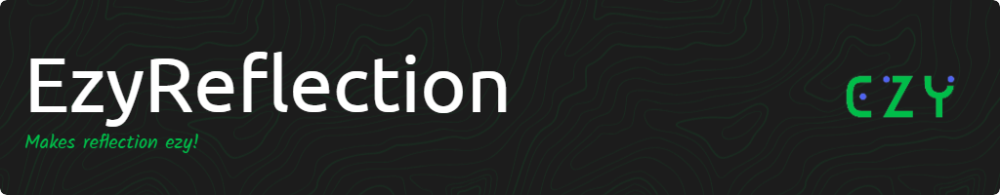

# EzyReflection [](https://github.com/gamedev-uv/EzyReflection/blob/main/LICENSE)

**Attempts to make reflection for Unity simpler!**

# Installation

Through the [**Unity Package Manager**](https://docs.unity3d.com/Manual/upm-ui-giturl.html) using the following Git URL :
```
https://github.com/gamedev-uv/EzyReflection.git
```
